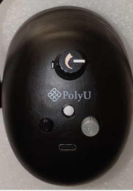

# 耳廓穴位點壓儀（AAD）
*使用說明書*

**[簡短說明](./index_zh-hant.md)** · **[PDF](./assets/Full_AAD_Manual_Both.pdf)** 

---

   
  <em>圖一</em>

   
  <em>圖二</em>

   
  <em>圖三</em>

   
  <em>圖四</em>

---

## 一般說明
此耳廓穴位點壓儀為提供針對性的耳穴按壓治療的裝置。此裝置配備一條頭帶，頭帶一側連接自動耳穴按壓儀，另一側則為耳罩（見圖一）。自動耳穴按壓儀設有可移動的壓力頭，用以刺激耳部相應穴位（見圖二）。控制鍵的位置如圖三所示。

---

## 佩戴與移除

**佩戴：**  
於佩戴前，請將壓力調控旋鈕（1）的白色指示條調至水平位置，以將指壓力度調至最低，令佩戴更舒適。  
將此裝置戴在頭上，確保自動耳穴按壓儀的耳模能夠貼合及覆蓋耳廓，同時把耳罩另一側的耳朵上（圖四）。

**移除：**  
移除此裝置前，請再次將壓力調控旋鈕（1）的白色指示條調至水平位置，以減低指壓力度。

*如需更多有關調控壓力的詳情，請參閱以下「壓力調節」部分。*

---

## 調整鬆緊舒適度
此裝置可透過延長長度調節臂（4）的長短來調整大小，以配合個人頭部尺寸。

---

## 電源開關
按下開/關按鈕（5）以開啟或關閉此裝置。  
此裝置可由內置電池供電，或透過 USB-C 輸入端口（6）連接外部電源供電。

---

## 電池指示燈（電源指示）

當此裝置由內置電池供電並運作時，電池指示燈（2）會顯示恆亮 藍色。  
如在開啟 AAD 後 藍燈 開始閃爍，表示電池需要充電。  
請將外部電源連接至 USB-C 輸入端口以充電。  
當電池電量過低時，藍色 指示燈可能會熄滅，此裝置亦可能隨時停止運作。  
當開啟 AAD 後 藍燈 閃爍時，請停止使用並為電池充電。

當裝置關機並連接外部電源（USB-C）時，指示燈顯示 紅色 表示正在充電，顯示 綠色 表示電池已充滿。  
請在 綠燈 亮起後拔除電源。

當裝置運作並同時連接 USB-C 電源充電時，指示燈會顯示為 洋紅色。  
當裝置運作並連接 USB-C 電源且電池已充滿時，指示燈會顯示為 青色。  
若裝置電池電量低且在充電時運作，洋紅燈 會閃爍。

---

## 壓力調節
當旋鈕上的白色指示條呈水平位置時（如圖五），按壓力度設為最低。  
如需增加壓力，可順時針旋轉壓力調控旋鈕（如圖六）。

   
  <em>圖五</em>

   
  <em>圖六</em>

---

## 電源關閉（電池隔離）
按下電源關閉按鈕（3）可完全切斷電池電源。  
當此裝置連接 USB-C 電源並按下電池關閉按鈕時，指示燈會顯示 綠色 並帶有 紅色 陰影，表示電池已隔離。  
一般情況下，使用者無需進行此操作。  
若按鈕無法按下，可能代表電池需更換。

---

## 充電方法
使用 USB-C 充電線將 USB-C 輸入端口（6）連接至充電器或合適的電源。  
充電期間，電池指示燈為 紅色；  
當電池完全充滿後，指示燈轉為 綠色。

---

*使用說明結束*
